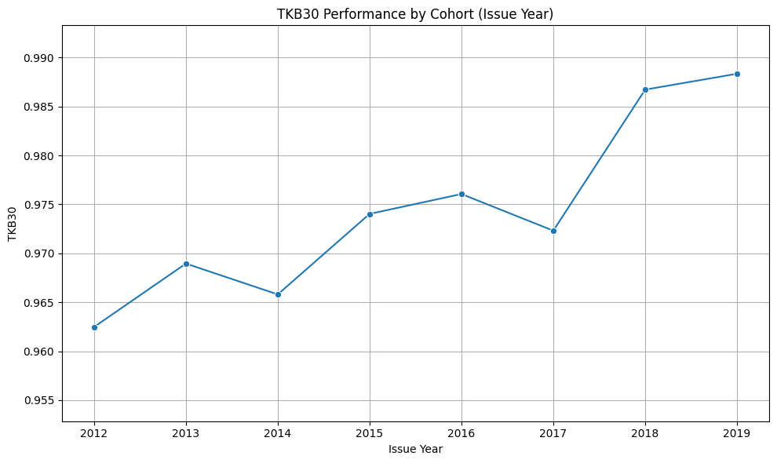

# 🏦 Loan Portfolio Risk Analysis
> **Impact:** Optimized a <mark><b>$2.80B outstanding portfolio</b></mark> and identified regional risk exposure for <mark><b>$1.2 billion in assets</b></mark>.

  
  &nbsp;
  

## 📌 Project Summary
This project evaluates the performance and risk profile of a consumer lending portfolio across **270.3K customers**. Using Python, I identified risk concentrations across cohorts, geographic regions, and loan purposes to improve RevoU FSDA portfolio stability and profitability.

---

## 🚀 Achievements (AQS Framework)
* **Evaluated** a $2.80B consumer loan portfolio using Python to identify key risk drivers and pricing anomalies.
* **Identified** that 60-month loans underperform 36-month loans, resulting in a **0.42% lower TKB30** despite higher interest rates.
* **Detected** an approval-verification bias where verified borrowers exhibited significantly higher delinquency rates (**12.85 vs. 5.49 DPD**).
* **Developed** portfolio recommendations to safeguard **$1.2 billion in assets** by reducing regional risk exposure in the West region.

---

## 📊 Visual Analysis & Technical Insights
*These visuals represent the risk assessment charts generated through the Python analytical workflow.*

---

### 1. Portfolio Health & Cohort Trends
<table>
  <tr>
    <td width="60%">
      
    </td>
    <td valign="top">
      <h4>Key Insights:</h4>
      <ul>
        <li><b>Performance Growth:</b> Visualizes a steady improvement in cohort performance from <b>96.2% (2012)</b> to <mark><b>98.8% (2019)</b></mark>.</li>
        <li><b>Metric Focus:</b> Tracks TKB30 (Success Rate) to evaluate long-term portfolio health.</li>
      </ul>
    </td>
  </tr>
</table>

---

### 2. Loan Duration Risk Gap (36 vs 60 Months)
<table>
  <tr>
    <td width="60%">
      
    </td>
    <td valign="top">
      <h4>Key Insights:</h4>
      <ul>
        <li><b>Mispricing Issue:</b> 60-month loans show a lower TKB30 (97.87%) despite carrying higher interest rates.</li>
        <li><b>Risk Recommendation:</b> Tighten credit standards for 60-month terms to align with the higher risk profile.</li>
      </ul>
    </td>
  </tr>
</table>

---

### 3. Regional Default Performance
<table>
  <tr>
    <td width="60%">
      
    </td>
    <td valign="top">
      <h4>Key Insights:</h4>
      <ul>
        <li><b>Geographic Concentration:</b> Identifies the West region as a lower-performance zone.</li>
        <li><b>Asset Protection:</b> Strategy focuses on rebalancing exposure away from high-risk regions to safeguard <mark><b>$1.2B in assets</b></mark>.</li>
      </ul>
    </td>
  </tr>
</table>

---

### 4. Income-Based Delinquency Risk
<table>
  <tr>
    <td width="60%">
      
    </td>
    <td valign="top">
      <h4>Key Insights:</h4>
      <ul>
        <li><b>Demographic Risk:</b> Demonstrates that low-income borrowers have <mark><b>~60% higher</b></mark> delinquency rates.</li>
        <li><b>Action:</b> Recommended reduction in exposure to high-risk loan purposes within low-income segments.</li>
      </ul>
    </td>
  </tr>
</table>

---

## 🛠️ Tools & Methods
- **Python Libraries:** Pandas for processing 270.3K records, Matplotlib/Seaborn for risk visualization.
- **Methods:** Exploratory Data Analysis (EDA), Loan Performance Modeling (TKB30/DPD30), Geographic Concentration Analysis, Segment Risk Analysis.

---

  <a href="../projects.html"><b>← Back to Project Archive</b></a>

