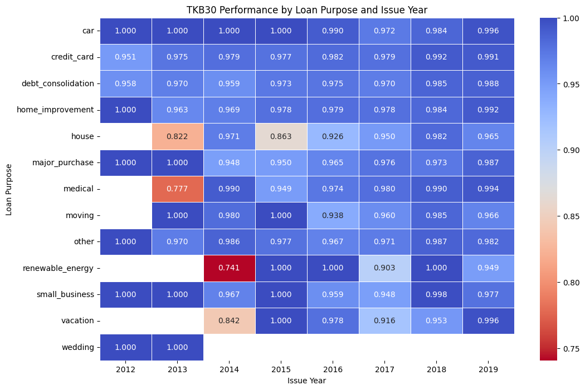
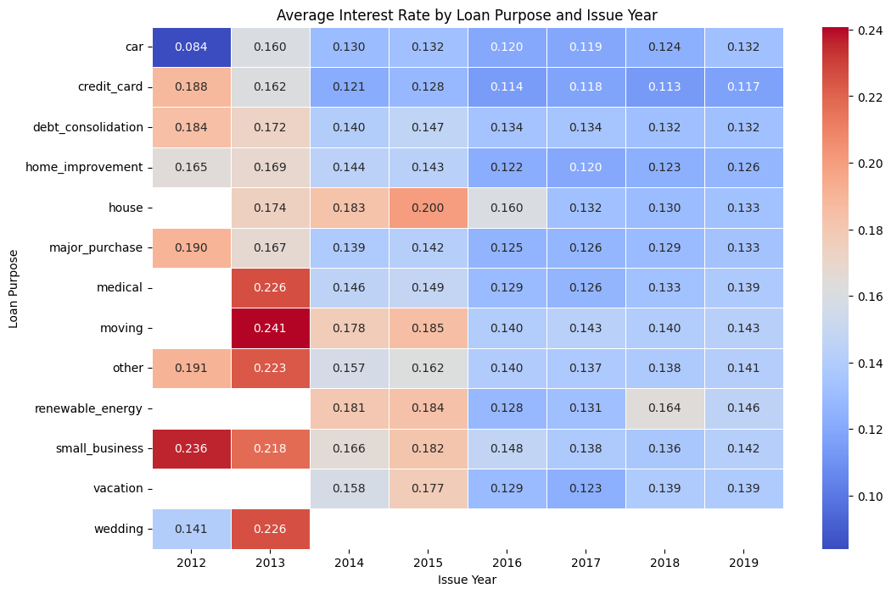
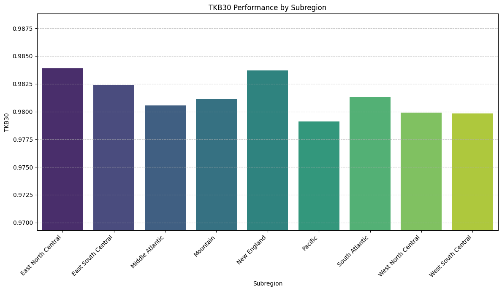

# 🏦 Loan Portfolio Risk Analysis
> **Impact:** Evaluated a <mark><b>$2.80B outstanding portfolio</b></mark> and identified regional risk exposure for <mark><b>$1.2 billion in assets</b></mark>.

  
  &nbsp;
  

## 📌 Project Summary
This project evaluates the performance and risk profile of a consumer lending portfolio across **270.3K customers**. Using Python, I identified risk concentrations across cohorts, geographic regions, and loan purposes to improve RevoU FSDA portfolio stability and profitability.

---

## 🚀 Achievements (AQS Framework)
* **Evaluated** a $2.80B consumer loan portfolio using Python to identify key risk drivers and pricing anomalies.
* **Identified** that 60-month loans underperform 36-month loans, resulting in a **0.42% lower TKB30** despite higher interest rates.
* **Detected** an approval-verification bias where verified borrowers exhibited significantly higher delinquency rates (**12.85 vs. 5.49 DPD**).
* **Developed** portfolio recommendations to safeguard **$1.2 billion in assets** by reducing regional risk exposure in the West region.

---

## 📊 Visual Analysis & Technical Insights
*The following visuals represent the risk assessment heatmaps and distribution charts generated through the Python analytical workflow.*

---

### 1. Portfolio Health & Cohort Trends
<table>
  <tr>
    <td width="60%">
      
    </td>
    <td valign="top">
      <h4>Key Insights:</h4>
      <ul>
        <li><b>Performance Growth:</b> Visualizes a steady improvement in cohort performance from <b>96.2% (2012)</b> to <mark><b>98.8% (2019)</b></mark>.</li>
        <li><b>Metric Focus:</b> Tracks TKB30 (Success Rate) to evaluate long-term portfolio stability and recovery trends.</li>
      </ul>
    </td>
  </tr>
</table>

---

### 2. TKB Performance by Loan Purpose (Heatmap)
<table>
  <tr>
    <td width="60%">
      
    </td>
    <td valign="top">
      <h4>Key Insights:</h4>
      <ul>
        <li><b>Risk Concentration:</b> Identifies specific loan purposes and issue years with lower TKB performance.</li>
        <li><b>High-Risk Detection:</b> Pinpoints clusters where delinquency rates are significantly higher than the portfolio average.</li>
      </ul>
    </td>
  </tr>
</table>

---

### 3. Average Interest Rate by Purpose (Heatmap)
<table>
  <tr>
    <td width="60%">
      
    </td>
    <td valign="top">
      <h4>Key Insights:</h4>
      <ul>
        <li><b>Pricing vs. Risk:</b> Analyzes if the interest rates appropriately compensate for the risk in high-risk loan purposes.</li>
        <li><b>Profitability Check:</b> Helps identify if specific categories are "mispriced" relative to their default probability.</li>
      </ul>
    </td>
  </tr>
</table>

---

### 4. Geographic Concentration (Top States & Sub-Regions)
<table>
  <tr>
    <td width="60%">
      
        
      
    </td>
    <td valign="top">
      <h4>Key Insights:</h4>
      <ul>
        <li><b>Regional Exposure:</b> Analyzes the top 4 states and sub-regions to detect geographic concentration risks.</li>
        <li><b>Asset Protection:</b> Strategy focuses on rebalancing exposure away from lower-performing sub-regions to safeguard <mark><b>$1.2B in assets</b></mark>.</li>
      </ul>
    </td>
  </tr>
</table>

---

## 🛠️ Tools & Methods
- **Python Libraries:** Pandas for data manipulation, Seaborn/Matplotlib for heatmap and distribution visualization.
- **Methods:** Cohort Analysis, Heatmap Risk Identification, Geographic Concentration Assessment, Pricing Strategy Analysis.

---

  <a href="../projects.html"><b>← Back to Project Archive</b></a>

