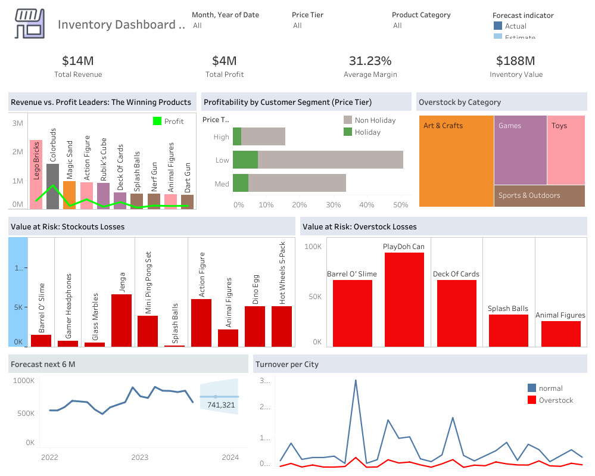

# 📈 Inventory & Revenue Growth Analysis (Maven Toys)
> **Impact:** Identified strategies to recapture <mark><b>$3.7M in lost revenue</b></mark> and achieve a <mark><b>10% growth target</b></mark>.

  
  &nbsp;
  
  &nbsp;
  

## 📌 Project Summary
This project analyzes the Mexico Toy Sales dataset to rectify inventory imbalances—specifically **stockouts and overstock**—to secure a **$14M revenue stream**.

---

## 🚀 Achievements (AQS Framework)
* **Analyzed** 829,000+ sales rows to identify a **$3.7M revenue leakage** caused by inventory stockouts.
* **Developed** a tiered pricing strategy revealing that the **Medium Price Tier** delivers a **33.7% profit margin**.
* **Engineered** a **Python Prophet forecast model** that identified a critical September sales dip.
* **Optimized** supply chain efficiency by identifying **"Zombie" inventory** (104 weeks of supply).

---

## 🛠️ Tools & Methods
- **Python (Prophet):** Time-series demand prediction.
- **Tableau:** Executive dashboards and regional mapping.
- **Methods:** Price Tier Segmentation, Inventory Status Analysis (Weeks of Supply).

---

## 📊 Visual Analysis & Executive Insights
*A deep dive into the business intelligence tools developed for this project. Click the "Live Dashboard" button above to interact with the full data.*

---

<table>
  <tr>
    <td width="60%">
      
    </td>
    <td>
      <h4>1. Executive Summary & Profitability</h4>
<h5>Key Insights:</h5>
      <ul>
        <li><b>KPI Tracking:</b> Displays the <mark><b>$14M Total Revenue</b></mark> and $4M Total Profit.</li>
        <li><b>Growth Path:</b> Maps current performance against the 10% growth target.</li>
        <li><b>Winning Products:</b> Identifies Colorbuds ($834k) as the primary profit engine.</li>
      </ul>
      <h6>2. Price Tier & Margin Optimization</h6>
    <h7>Key Insights:</h7>
      <ul>
        <li><b>Margin Analysis:</b> Compares the 15.66%, 33.7%, and 50.64% margins across tiers.</li>
        <li><b>Strategy:</b> Proves the <b>Medium Tier</b> is the "sweet spot" for volume and profit.</li>
      </ul>
 <h8>3. Forecasting the "September Slump"</h8>
      <h9>Key Insights:</h9>
      <ul>
        <li><b>Predictive Modeling:</b> Built with <b>Python Prophet</b> to see 180 days ahead.</li>
        <li><b>Actionable Warning:</b> Specifically pinpointed a seasonal revenue dip in September.</li>
      </ul>
      <h10> 4. Inventory "Red Zone" & Supply Chains</h10>
       <h11>Key Insights:</h11>
      <ul>
        <li><b>Geospatial Risks:</b> Highlights <b>La Paz and Toluca</b> as critical stockout zones.</li>
        <li><b>Stock Imbalance:</b> Visualizes "Zombie" inventory (104 weeks) vs. stockouts (<5 weeks).</li>
      </ul>
    </td>
  </tr>
</table>

---

  <a href="../index.md"><b>← Back to Main Portfolio</b></a>

