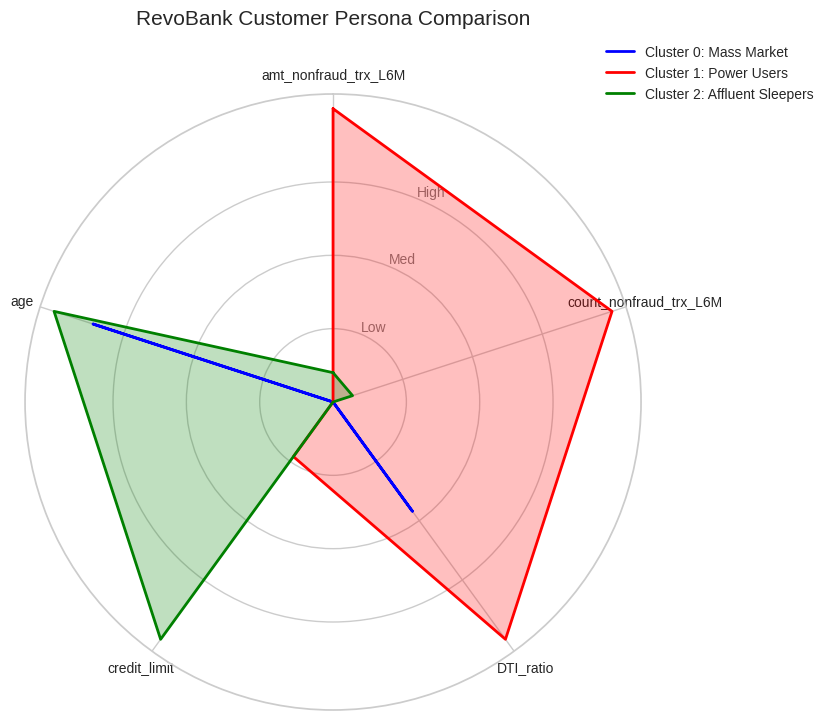
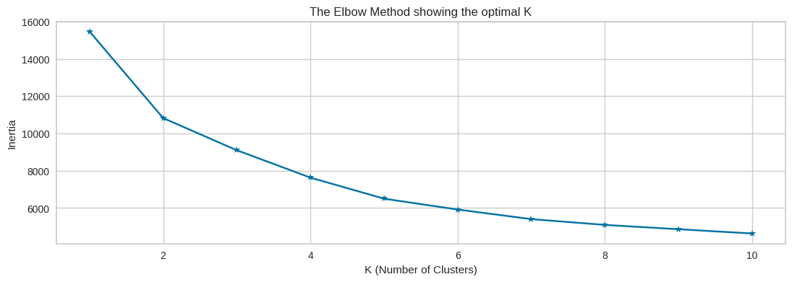
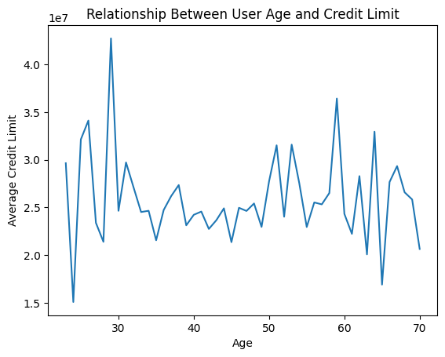
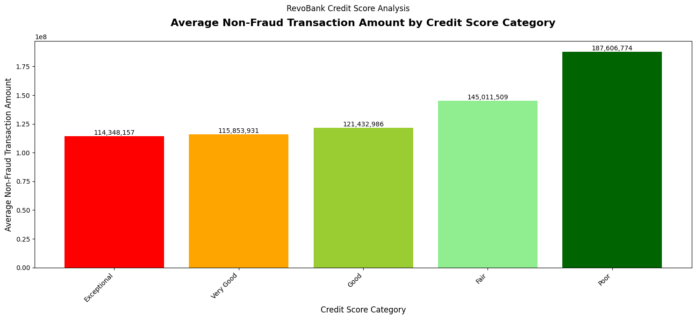

# 💳 RevoBank Customer Credit Engagement Analysis
> **Impact:** Developed a strategy to increase credit usage by <mark><b>10% within 6 months</b></mark> through K-Means Clustering.

  
  &nbsp;
  

## 📌 Project Summary
This project addresses low credit card utilization at RevoBank, Indonesia. By leveraging customer demographics and transaction data, I developed a segmentation model to drive growth and profitability through personalized marketing strategies.

---

## 🚀 Achievements (AQS Framework)
* **Analyzed** transaction behavior for **5,500+ customers** using Python to identify opportunities for a **10% revenue increase**.
* **Engineered** K-means clustering models to segment the base into three distinct personas, improving marketing precision.
* **Calculated** an MDR profit of <mark><b>Rp 5.8B</b></mark> by analyzing volumes across age segments and card brands.
* **Identified** a low fraud rate of **0.22%** while pinpointing high-value outliers for enhanced security controls.

---

## 📊 Visual Analysis & Technical Insights
*The following visuals represent key outputs from the Python analytical workflow (Clustering & EDA).*

---

### 1. Customer Persona Segmentation
<table>
  <tr>
    <td width="60%">
      
    </td>
    <td>
      <h4>Key Insights:</h4>
      <ul>
        <li><b>Persona ID:</b> Clusters 0, 1, and 2 represent "Stable Mass," "Power Users," and "Affluent Sleepers."</li>
        <li><b>Active Spenders:</b> Cluster 1 identified as the revenue catalyst, generating <mark><b>Rp 2.48B</b></mark> in profit.</li>
      </ul>
    </td>
  </tr>
</table>

---

### 2. Technical Validation (Clustering)
<table>
  <tr>
    <td width="60%">
      
    </td>
    <td>
      <h4>Key Insights:</h4>
      <ul>
        <li><b>Model Accuracy:</b> Used the <b>Elbow Method</b> and Silhouette Scores to validate the 3-cluster selection.</li>
        <li><b>Data Scaling:</b> Applied <b>Robust Scaler</b> to handle significant spending outliers effectively.</li>
      </ul>
    </td>
  </tr>
</table>

---

### 3. Age Segment vs. Spending
<table>
  <tr>
    <td width="60%">
      
    </td>
    <td>
      <h4>Key Insights:</h4>
      <ul>
        <li><b>Cash Cow:</b> The 46–60 age segment contributes a massive <mark><b>Rp 169.5 Billion</b></mark> in spending.</li>
        <li><b>Targeting:</b> Justifies a shift toward high-capacity older demographics for premium card tiers.</li>
      </ul>
    </td>
  </tr>
</table>

---

### 4. Risk & Credit Mapping
<table>
  <tr>
    <td width="60%">
      
    </td>
    <td>
      <h4>Key Insights:</h4>
      <ul>
        <li><b>DTI Analysis:</b> Correlated Debt-to-Income ratios with credit scores to manage risk.</li>
        <li><b>Security:</b> Identified a healthy **0.22% fraud rate**, supporting higher credit limit recommendations.</li>
      </ul>
    </td>
  </tr>
</table>

---

## 🛠️ Tools & Methods
- **Python Libraries:** Pandas, Scikit-learn (K-means), Robust Scaler, Matplotlib/Seaborn.
- **Methods:** User Persona Development, Risk Assessment (DTI), MDR Profit Calculation.

---

  <a href="../index.md"><b>← Back to Main Portfolio</b></a>

